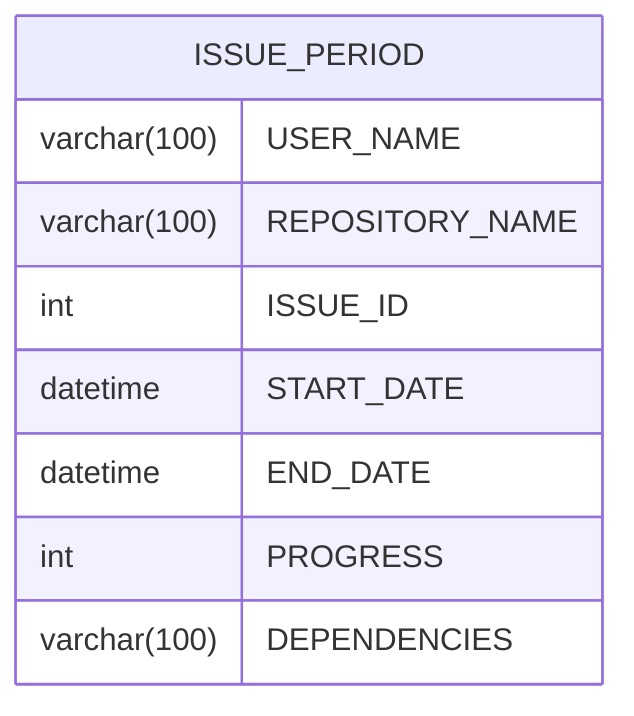

## まだ書きかけです…

あしからず

## 概要

[GitBucket](https://gitbucket.github.io/) は、[GitHub](https://github.com/) のようにネットワーク上で [Git](https://git-scm.com/) リポジトリを共有できる Web サービスです。

- Apache-2.0 ライセンスで配布されている。
- [Scala](https://scala-lang.org/) で開発されており、Java 17 実行環境があれば、起動可能。
- お試しであれば、内臓の[H2データベースエンジン](https://www.h2database.com/html/main.html)が利用できる。
  - 実運用には、[PostgreSQL](https://www.h2database.com/html/main.html) や　[MariaDB](https://mariadb.org/) などのリレーショナルデータベースサーバーの利用を推奨
- 非常に簡単にセルフホストが可能です。

私は、[GitBucket Markdown Enhanced Plugin](https://github.com/yasumichi/gitbucket-markdown-enhanced) という GitBucket 標準のマークダウンレンダリングエンジンを置き換えるプラグインを開発中です。

GitBucket のコミュニティプラグインには、既にガントチャートを表示できる [Gantt Chart plugin](https://github.com/kasancode/gitbucket-gantt-plugin) がありますが、期間を設定できないのが、個人的に不満でした。

そこで issue に開始日・終了日・進捗率等を登録し、ガントチャートに表示するプラグイン [GitBucket Flexible Gantt Plugin](https://github.com/yasumichi/gitbucket-flexible-gantt-plugin) を作成してみました。

その開発の記録です。

## 現状の成果

現状の成果として、[0.1.0](https://github.com/yasumichi/gitbucket-flexible-gantt-plugin/releases/tag/v0.1.0) をβリリースしました。

- まだ、ユーザーへの通知が表示されるべき場面で通知が表示されなかったり、エラー処理が未実装だったりします。
- 少量のデータでしか、試験しておりません。ガントチャートに表示する issue の絞り込みもできません。

以下のように登録済みの issue を表示すると右側のサイドバーに開始日、終了日、進捗、依存 issue を設定するためのフォームが表示されます。


:::note info
新規作成時は表示されません。
:::

リポジトリのサイドバーにある `Flexible Gantt` というメニューをクリックすると以下のようなガントチャートが表示されます。


- ガントチャート上のタスクをクリックすると該当する issue が、別ウィンドウで開きます。
- 開始日、終了日、進捗をドラッグ＆ドロップで更新できます。

## 作成しようと思ったきっかけ

概要にも書きましたが、GitBucket のコミュニティプラグインには、既にガントチャートを表示できる [Gantt Chart plugin](https://github.com/kasancode/gitbucket-gantt-plugin) がありますが、期間を設定できないのが、個人的に不満でした。

GitBucket Markdown Enhanced Plugin を開発するための情報収集中に以下の記事を見つけました。

- [GitBucketのissueで作業量を設定できるプラグイン #JavaScript - Qiita](https://qiita.com/Takumon/items/25e19501192623165407)

この記事では、issue に作業量を設定できる項目を追加し、統計などを取れるようにしたプラグインが紹介されていました。

GitBucket Markdown Enhanced Plugin の開発がひと段落したら、この記事を参考に issue に開始日・終了日を設定し、ガントチャートに表示するプラグインを作成したいと考えていました。

## ガントチャートに使用するライブラリ

ガントチャートのライブラリに関する比較記事等を見て検討した結果、[Frappe社](https://frappe.io/)の [Frappe Gantt](https://github.com/frappe/gantt) を採用することにしました。

決め手は、以下の通りです。(他のライブラリも同様かもしれませんが…)

- ガントチャート上で日程・進捗の変更ができ、そのイベントハンドラーを書ける
- ガントチャート上のタスクをクリックした際のハンドラーを書ける
- タスクの依存関係を設定できる
- デザインが気に入った

使用に当たり、以下の記事を参考にしました。

- [タスク、プロジェクト管理の表示に便利なガントチャートライブラリまとめ | hifive開発者ブログ](https://blog.htmlhifive.com/2014/09/18/gantt-chart-library-suitable-for-task-project-management/)
- [手軽にガントチャートを作れる JavaScript ライブラリ『Frappe Gantt』の使い方](https://zenn.dev/rabee/articles/how-to-use-frappe-gantt-js)
- [frappe-ganttを使ってガントチャートを作成する方法 - utamaro’s blog](https://utamaro.hatenablog.jp/entry/2018/10/04/191822)
- [Frappe Ganttとは？シンプルで使いやすいWebガントチャートライブラリの特徴と概要 | 株式会社一創](https://www.issoh.co.jp/tech/details/4090/)

## プラグイン用のテーブルをデータベースに追加する

プラグイン用のテーブル ISSUE_PERIOD をデータベースに追加しました。



※わざわざ [mermaid](https://mermaid.js.org/) の ER図にする必要はないかもしれませんが…

### Solidbaseというライブラリを使用

GitBucketプラグインでデータベーステーブルを追加するには、[Solidbase](https://github.com/gitbucket/solidbase) というライブラリを使用してスキーマの自動更新を実装します。これにより、プラグインのバージョンアップ時に自動的にデータベーススキーマが更新されるようになります。

Solidbase は、GitBucket の開発者であるたけぞうさんが作成したライブラリです。

- [マルチリソース、マルチテナントに対応したDBマイグレーションツール「solidbase」1.0.0をリリースしました - たけぞう瀕死ブログ](https://takezoe.hatenablog.com/entry/2016/04/17/120701)

GitBucketの起動時、Solidbaseがデータベースのバージョン (VERSIONSテーブルに格納されています) をチェックし、定義されたバージョンとの差分に基づいてスキーマー更新ファイルを実行します。これにより、プラグイン独自のテーブルが自動的に作成されます。

- [Automatic Schema Updating](https://github.com/gitbucket/gitbucket/blob/master/doc/auto_update.md)

### スキーマ更新ファイルの作成

src/main/resources/update/ ディレクトリ配下に、新しいバージョンのスキーマ更新ファイル (SQLファイルまたはXMLファイル) を配置します。

#### XMLの場合

今回は、XML による方法を採用しました。

[src\main\resources\update\gitbucket-flexible-gantt-0.1.0.xml](https://github.com/yasumichi/gitbucket-flexible-gantt-plugin/blob/f85d0e9ad061f398d500f5c6fd23e76de21d1efa/src/main/resources/update/gitbucket-flexible-gantt-0.1.0.xml)

```xml:src\main\resources\update\gitbucket-flexible-gantt-0.1.0.xml
<?xml version="1.0" encoding="UTF-8"?>
<changeSet>
    <!--================================================================================================-->
    <!-- ISSUE_PERIOD -->
    <!--================================================================================================-->
    <createTable tableName="ISSUE_PERIOD">
        <column name="USER_NAME"        type="varchar(100)" nullable="false"/>
        <column name="REPOSITORY_NAME"  type="varchar(100)" nullable="false"/>
        <column name="ISSUE_ID"         type="int"          nullable="false"/>
        <column name="START_DATE"       type="datetime"     nullable="false"/>
        <column name="END_DATE"         type="datetime"     nullable="false"/>
        <column name="PROGRESS"         type="int"          nullable="false"/>
        <column name="DEPENDENCIES"     type="varchar(100)" nullable="false"/>
    </createTable>

    <addPrimaryKey
            constraintName="IDX_ISSUE_PERIOD_PK"
            tableName="ISSUE_PERIOD"
            columnNames="USER_NAME, REPOSITORY_NAME, ISSUE_ID"/>
    <addForeignKeyConstraint
            constraintName="IDX_ISSUE_PERIOD_FK0"
            baseTableName="ISSUE_PERIOD"
            baseColumnNames="USER_NAME, REPOSITORY_NAME, ISSUE_ID"
            referencedTableName="ISSUE"
            referencedColumnNames="USER_NAME, REPOSITORY_NAME, ISSUE_ID"/>
</changeSet>
```

#### SQLの場合

SQLファイルを使用する場合、ファイル名は `${moduleId}_${version}.sql` の形式に従う必要があります。 
例えば、myplugin というモジュールIDで、バージョン 1.0.0 のスキーマ更新を行う場合、以下のファイル名となります。

作成したファイル内にテーブル作成のSQL文を記述します。

```sql:src/main/resources/update/myplugin_1.0.0.sql
CREATE TABLE MY_NEW_TABLE (
    ID INT PRIMARY KEY,
    NAME VARCHAR(255)
);
```

### バージョン定義の追加

プラグイン本体に新しいバージョン定義を追加します。

[src\main\scala\Plugin.scala](https://github.com/yasumichi/gitbucket-flexible-gantt-plugin/blob/f85d0e9ad061f398d500f5c6fd23e76de21d1efa/src/main/scala/Plugin.scala#L27)

```scala
  override val versions: List[Version] = List(
    new Version("0.1.0", new LiquibaseMigration("update/gitbucket-flexible-gantt-0.1.0.xml"))
  )
```

バージョン番号とともにスキーマ更新ファイルのパスを与えた `LiquibaseMigration` クラスのインスタンスを指定する必要があります。

## プラグイン本体でデータベースに関連した処理を行う場合に出たエラー

当プラグインでは、issue のサイドバー追加を [gitbucket.core.plugin.Plugin](https://github.com/gitbucket/gitbucket/blob/9ddd2065b726a8dae7a6ecf394e0d4e35f1ebb1a/src/main/scala/gitbucket/core/plugin/Plugin.scala) を継承した [Plugin](https://github.com/yasumichi/gitbucket-flexible-gantt-plugin/blob/f85d0e9ad061f398d500f5c6fd23e76de21d1efa/src/main/scala/Plugin.scala) クラスで [issueSidebars](https://github.com/yasumichi/gitbucket-flexible-gantt-plugin/blob/f85d0e9ad061f398d500f5c6fd23e76de21d1efa/src/main/scala/Plugin.scala#L60) メソッドを override して実施しています。

該当 issue の情報を取得するため、[RepositoryService](https://github.com/gitbucket/gitbucket/blob/9ddd2065b726a8dae7a6ecf394e0d4e35f1ebb1a/src/main/scala/gitbucket/core/service/RepositoryService.scala) を同時に継承し、リポジトリの情報と issue の情報を取得していますが、当初、以下のエラーメッセージに悩まされました。

```
could not find implicit value for parameter s: gitbucket.core.model.Profile.profile.blockingApi.Session
```

最終的に以下のコードを追加することでエラーを回避することができました。

```scala
      implicit val session: Session = Database.getSession(context.request)
```

## GitBucket はデータベースクエリの処理に Slick というライブラリを利用している

GitBucket はデータベースクエリの処理に [Slick](https://scala-slick.org/) というライブラリを利用しています。

現在の GitBucket が同梱している Slick は 3.4.1 です。

[GitBucketのissueで作業量を設定できるプラグイン #JavaScript - Qiita](https://qiita.com/Takumon/items/25e19501192623165407) で紹介されているプラグイン [gitbucket-issue-estimation-plugin](https://github.com/Takumon/gitbucket-issue-estimation-plugin) では、レコードの追加・更新に [insertOrUpdate](https://github.com/Takumon/gitbucket-issue-estimation-plugin/blob/31435ed5062361094a47a1b5c7e70d7233e4adce/src/main/scala/gitbucket/plugin/service/IssueEstimateService.scala#L38C20-L38C34) メソッドを使用しています。

これに倣い、`insertOrUpdate` メソッドを使用したのですが、[H2](https://h2database.com/html/main.html) データベースではうまく動きませんでした。

調査したところ、`insertOrUpdate` メソッドは、MySQL のみ対応していることが分かりました…。

- [Supported Databases · Slick](https://scala-slick.org/doc/3.4.1/supported-databases.html)

仕方がないので既存のレコードがなければ insert、あれば update を行うように修正しました。

[src\main\scala\io\github\yasumichi\gfg\service\IssuePeriodService.scala](https://github.com/yasumichi/gitbucket-flexible-gantt-plugin/blob/f85d0e9ad061f398d500f5c6fd23e76de21d1efa/src/main/scala/io/github/yasumichi/gfg/service/IssuePeriodService.scala#L93)

## Trait の継承地獄

[Trait](https://docs.scala-lang.org/ja/tour/traits.html) は、Scala 公式ドキュメントで

> それらはJava 8のインターフェースと似ています。 

と紹介されていますが、そのつもりでコーディングするとハマります。（あくまで個人の感想であり…）

データベースへの接続は、service 層が担当します。GitBucket では、各 Service は、Trait として定義されています。

先ほどの Trait の公式ドキュメントに以下のように書いてあります。

> クラスとオブジェクトはトレイトを継承することができますが、トレイトはインスタンス化ができません

controller 層などから、サービスのデータベース操作を利用する場合、その Trait を継承する必要があります。

Trait には、この Trait を継承する場合は、別の Trait も継承しなければならないという縛りがあるらしく、以下のエラーに何度も苦しめられました。

```
illegal inheritance;
 self-type io.github.yasumichi.gfg.controller.FlexibleGanttController does not conform to 
```

認識謝りがありましたら、ご教示いただけますと幸いです。

## データベースを扱うサービスは CoreProfile を継承~~しapi を import した方が良さげ~~

データベースを扱うサービスは、 [gitbucket.core.model.CoreProfile](https://github.com/gitbucket/gitbucket/blob/9ddd2065b726a8dae7a6ecf394e0d4e35f1ebb1a/src/main/scala/gitbucket/core/model/Profile.scala#L45) を継承~~し、CoreProfile.profile.api を import ~~した方が良いです。

:::note info
api の実態は、[Slick](https://scala-slick.org/) の [slick.jdbc.JdbcProfile](https://github.com/slick/slick/blob/v3.4.1/slick/src/main/scala/slick/jdbc/JdbcProfile.scala) で定義されている [api](https://github.com/slick/slick/blob/v3.4.1/slick/src/main/scala/slick/jdbc/JdbcProfile.scala#L67) というフィールドのようです。
:::

当プラグインでは、[src\main\scala\io\github\yasumichi\gfg\service\IssuePeriodService.scala](https://github.com/yasumichi/gitbucket-flexible-gantt-plugin/blob/f85d0e9ad061f398d500f5c6fd23e76de21d1efa/src/main/scala/io/github/yasumichi/gfg/service/IssuePeriodService.scala#L57) にその辺の記述があります。

以下で関連する部分のみ抜粋します。

```scala:src\main\scala\io\github\yasumichi\gfg\service\IssuePeriodService.scala
trait IssuePeriodService {
  self: CoreProfile
(中略)
    with WritableUsersAuthenticator =>
  import gitbucket.core.service.IssuesService._
  import self.profile.api
```

CoreProfile を継承しないと `filter()` や `join()` などのメソッドがコンパイルエラーになりました。

:::note info
再確認したところ、`import self.profile.api` はなくてもコンパイル通りました。
:::

## issue サイドバー表示の流れ

- [Plugin](https://github.com/yasumichi/gitbucket-flexible-gantt-plugin/blob/f85d0e9ad061f398d500f5c6fd23e76de21d1efa/src/main/scala/Plugin.scala) クラスで [issueSidebars](https://github.com/yasumichi/gitbucket-flexible-gantt-plugin/blob/f85d0e9ad061f398d500f5c6fd23e76de21d1efa/src/main/scala/Plugin.scala#L60) が、issue の情報を取得し、[twirl](https://github.com/playframework/twirl) テンプレート [src\main\twirl\flexiblegantt\issuesidebar.scala.html](https://github.com/yasumichi/gitbucket-flexible-gantt-plugin/blob/f85d0e9ad061f398d500f5c6fd23e76de21d1efa/src/main/twirl/flexiblegantt/issuesidebar.scala.html) から HTML を生成し、クライアントに返す。

```scala:src/main/scala/Plugin.scala
  override val issueSidebars: Seq[(Issue, RepositoryInfo, Context) => Option[Html]] =
    Seq((issue: Issue, repository: RepositoryInfo, context: Context) => {
      implicit val session: Session = Database.getSession(context.request)
      var isEditable = false
      if (!issue.isPullRequest) {
        if (context.loginAccount.isDefined) {
          isEditable = hasDeveloperRole(repository.owner, repository.name, context.loginAccount)
        }
        Some(html.issuesidebar(repository.owner, repository.name, issue.issueId, isEditable)(context))
      } else None
    })
```

- 返却された HTML に埋め込まれている JavaScript が、既存のデータがないか、[FlexibleGanttController](https://github.com/yasumichi/gitbucket-flexible-gantt-plugin/blob/f85d0e9ad061f398d500f5c6fd23e76de21d1efa/src/main/scala/io/github/yasumichi/gfg/controller/FlexibleGanttController.scala) に AJAX で問い合わせ、フォームの初期値を設定

本当は、Issue サイドバーを返却する時点で初期値を埋め込みたかったのですが、[IssuePeriodService](https://github.com/yasumichi/gitbucket-flexible-gantt-plugin/blob/f85d0e9ad061f398d500f5c6fd23e76de21d1efa/src/main/scala/io/github/yasumichi/gfg/service/IssuePeriodService.scala) を継承しようとした際に Trait 継承地獄にハマったので断念。

```js:src\main\twirl\flexiblegantt\issuesidebar.scala.html
    document.addEventListener('DOMContentLoaded', (e) => {
        const url = "@context.path/@owner/@repositoryName/flexible-gantt/issues/@issueId"
        fetch(url)
        .then(res => {
            if (res.ok) {
                return res.json();
            }
        })
        .then(data =>{
            if (data.period.length == 0) return;
            var period = data.period[0];
            document.querySelector("input[name='startDate']").value = (new Date(Date.parse(period.startDate)))
                .toLocaleDateString("ja-JP", {year: "numeric",month: "2-digit",  day: "2-digit"}).replaceAll('/', '-');
            document.querySelector("input[name='endDate']").value =  (new Date(Date.parse(period.endDate)))
                .toLocaleDateString("ja-JP", {year: "numeric",month: "2-digit",  day: "2-digit"}).replaceAll('/', '-');
            document.querySelector("select[name='progress']").value = period.progress;
            document.querySelector("input[name='dependencies']").value = period.dependencies;
        })
    })
```

- [FlexibleGanttController](https://github.com/yasumichi/gitbucket-flexible-gantt-plugin/blob/f85d0e9ad061f398d500f5c6fd23e76de21d1efa/src/main/scala/io/github/yasumichi/gfg/controller/FlexibleGanttController.scala)が、レコードを検索し、JSON で返却

```scala:src\main\scala\io\github\yasumichi\gfg\controller\FlexibleGanttController.scala
  ajaxGet("/:owner/:repository/flexible-gantt/issues/:issueId")(readableUsersOnly { repository =>
    context.withLoginAccount { loginAccount =>
      implicit val session: Session = Database.getSession(context.request)
      contentType = formats("json")
      val issueId:Int = params("issueId").toInt
      org.json4s.jackson.Serialization.write(
        "period" ->
          getIssuePeriod(repository.owner, repository.name, issueId)
            .map { t =>
              Map(
                "startDate" -> t.startDate,
                "endDate" -> t.endDate,
                "progress" -> t.progress,
                "dependencies" -> t.dependencies
              )
            }
      )
    }
  })
```

## Issue 開始日等の登録の流れ

- `Set` ボタンをクリックすると twirl テンプレート [src\main\twirl\flexiblegantt\issuesidebar.scala.html](https://github.com/yasumichi/gitbucket-flexible-gantt-plugin/blob/f85d0e9ad061f398d500f5c6fd23e76de21d1efa/src/main/twirl/flexiblegantt/issuesidebar.scala.html) に埋め込まれた JavaScript が、[FlexibleGanttController](https://github.com/yasumichi/gitbucket-flexible-gantt-plugin/blob/f85d0e9ad061f398d500f5c6fd23e76de21d1efa/src/main/scala/io/github/yasumichi/gfg/controller/FlexibleGanttController.scala) に登録を依頼

```js:src\main\twirl\flexiblegantt\issuesidebar.scala.html
    document.getElementById("gfgpost").addEventListener('click', (e) => {
        const form = document.getElementById("gfgform")
        const params = new URLSearchParams();
        params.append("startDate", document.querySelector("input[name='startDate']").value)
        params.append("endDate", document.querySelector("input[name='endDate']").value)
        params.append("progress", document.querySelector("select[name='progress']").value)
        params.append("dependencies", document.querySelector("input[name='dependencies']").value)
        const action = form.getAttribute("action")
        const options = {
            method: 'POST',
            body: params
        }
        fetch(action, options).then((e) => {
            if(e.status === 200) {
                console.log(e)
                return
            }
            console.log(e)
        })
    })
```

- [FlexibleGanttController](https://github.com/yasumichi/gitbucket-flexible-gantt-plugin/blob/f85d0e9ad061f398d500f5c6fd23e76de21d1efa/src/main/scala/io/github/yasumichi/gfg/controller/FlexibleGanttController.scala)が、リクエストを受け取り、[IssuePeriodService](https://github.com/yasumichi/gitbucket-flexible-gantt-plugin/blob/f85d0e9ad061f398d500f5c6fd23e76de21d1efa/src/main/scala/io/github/yasumichi/gfg/service/IssuePeriodService.scala) を使って登録

```scala:src/main/scala/io/github/yasumichi/gfg/controller/FlexibleGanttController.scala
  ajaxPost("/:owner/:repository/issues/:issueId/period")(writableUsersOnly { repository =>
    context.withLoginAccount { loginAccount =>
      implicit val session: Session = Database.getSession(context.request)
      val formatter: SimpleDateFormat = new SimpleDateFormat("yyyy-MM-dd")

      val userName = params("owner")
      val repositoryName = params("repository")
      val issueId = params("issueId")

      val startDate: Date = if (params("startDate") == "") null else formatter.parse(params("startDate"))
      val endDate: Date = if (params("endDate") == "") null else formatter.parse(params("endDate"))
      val progress = params("progress")
      val dependencies = params("dependencies")

      logger.info("params get")

      logger.info("upsertIssuePeriod call")
      insertIssuePeriod(userName, repositoryName, issueId.toInt, startDate, endDate, progress.toInt, dependencies)

      org.json4s.jackson.Serialization.write(
        Map(
          "message" -> "updated issue period"
        )
      )
    }
  })
```

## ガントチャート表示の流れ

- [Plugin](https://github.com/yasumichi/gitbucket-flexible-gantt-plugin/blob/f85d0e9ad061f398d500f5c6fd23e76de21d1efa/src/main/scala/Plugin.scala)がリポジトリにサイドバーを表示

```scala:src/main/scala/Plugin.scala
  override val repositoryMenus = Seq((repositoryInfo: RepositoryInfo, context: Context) =>
    Some(Link("flexible-gantt", "Flexible Gantt", "/flexible-gantt", Some("dashboard")))
  )
```

- ユーザーがリポジトリサイドバーの `Flexible Gantt` メニューをクリックすると [FlexibleGanttController](https://github.com/yasumichi/gitbucket-flexible-gantt-plugin/blob/f85d0e9ad061f398d500f5c6fd23e76de21d1efa/src/main/scala/io/github/yasumichi/gfg/controller/FlexibleGanttController.scala)が Twirl テンプレート [src/main/twirl/flexiblegantt/flexiblegantt.scala.html](https://github.com/yasumichi/gitbucket-flexible-gantt-plugin/blob/f85d0e9ad061f398d500f5c6fd23e76de21d1efa/src/main/twirl/flexiblegantt/flexiblegantt.scala.html) を元に HTML を返却

```scala:src/main/scala/io/github/yasumichi/gfg/controller/FlexibleGanttController.scala
  get("/:owner/:repository/flexible-gantt") {
    referrersOnly { repository: RepositoryInfo =>
      {
        html.flexiblegantt(repository)
      }
    }
  }
```

- [Plugin](https://github.com/yasumichi/gitbucket-flexible-gantt-plugin/blob/f85d0e9ad061f398d500f5c6fd23e76de21d1efa/src/main/scala/Plugin.scala)が [Frappe Gantt](https://github.com/frappe/gantt) 用のスタイルシート [frappe-gantt.css](src\main\resources\flexible-gantt\assets\frappe-gantt.css)と JavaScript [frappe-gantt.umd.js](src\main\resources\flexible-gantt\assets\frappe-gantt.umd.js) を読み込むように注入

```scala:src/main/scala/Plugin.scala
  override def javaScripts(
      registry: PluginRegistry,
      context: ServletContext,
      settings: SystemSettingsService.SystemSettings
  ): Seq[(String, String)] = {

    val path = settings.baseUrl.getOrElse(context.getContextPath)

    Seq(
      ".*/flexible-gantt" ->
        s"""|</script>
          |
          |<link rel="stylesheet" href="$path/plugin-assets/flexible-gantt/frappe-gantt.css">
          |<script type="text/javascript" src="$path/plugin-assets/flexible-gantt/frappe-gantt.umd.js"></script>
          |
          |<script>
          |""".stripMargin
    )
  }
```

- [FlexibleGanttController](https://github.com/yasumichi/gitbucket-flexible-gantt-plugin/blob/f85d0e9ad061f398d500f5c6fd23e76de21d1efa/src/main/scala/io/github/yasumichi/gfg/controller/FlexibleGanttController.scala)が返却した HTML に埋め込まれた JavaScript が issue の情報を AJAX で取得

```js:src\main\twirl\flexiblegantt\flexiblegantt.scala.html
                const url = "@context.baseUrl/@repository.owner/@repository.name/flexible-gantt/issues";
                fetch(url)
                .then(res => {
                    if (res.ok) {
                        return res.json();
                    }
                })
```

- [FlexibleGanttController](https://github.com/yasumichi/gitbucket-flexible-gantt-plugin/blob/f85d0e9ad061f398d500f5c6fd23e76de21d1efa/src/main/scala/io/github/yasumichi/gfg/controller/FlexibleGanttController.scala)がリクエストに答えて JSON を返却

```scala:src/main/scala/io/github/yasumichi/gfg/controller/FlexibleGanttController.scala
  ajaxGet("/:owner/:repository/flexible-gantt/issues")(readableUsersOnly { repository =>
    context.withLoginAccount { loginAccount =>
      implicit val session: Session = Database.getSession(context.request)
      contentType = formats("json")
      org.json4s.jackson.Serialization.write(
        "list" ->
          getIssuePeriods(repository.owner, repository.name)
            .map { t =>
              Map(
                "id" -> t._2.issueId.toString(),
                "name" -> t._2.title,
                "start" -> t._1.startDate,
                "end" -> t._1.endDate,
                "progress" -> t._1.progress,
                "dependencies" -> t._1.dependencies
              )
            }
      )
    }
  })
```

- 返却された JSON を元にガントチャートを描画

```js:src\main\twirl\flexiblegantt\flexiblegantt.scala.html
               .then(data => {
                    const tasks = data.list;
                    var gantt_chart = new Gantt("#gantt", tasks, {
                        on_click: function (task) {
                            window.open(issuebase + task.id)
                        },
                        on_date_change: function(task, start, end) {
                            var postUrl = issuebase + task.id + postSuffix;
                            const params = new URLSearchParams();
                            params.append("startDate", start.toLocaleDateString("ja-JP", {year: "numeric",month: "2-digit",  day: "2-digit"}).replaceAll('/', '-'));
                            params.append("endDate", end.toLocaleDateString("ja-JP", {year: "numeric",month: "2-digit",  day: "2-digit"}).replaceAll('/', '-'));
                            params.append("progress", task.progress);
                            params.append("dependencies", task.dependencies);
                            const options = {
                                method: 'POST',
                                body: params
                            };
                            fetch(postUrl, options).then((e) => {
                                if (e.status === 200) {
                                    console.log(e)
                                    return
                                }
                                console.log(e)
                            })
                        },
                        on_progress_change: function(task, progress) {
                            var postUrl = issuebase + task.id + postSuffix;
                            const params = new URLSearchParams();
                            params.append("startDate", (new Date(task.start)).toLocaleDateString("ja-JP", {year: "numeric",month: "2-digit",  day: "2-digit"}).replaceAll('/', '-'));
                            params.append("endDate", (new Date(task.end)).toLocaleDateString("ja-JP", {year: "numeric",month: "2-digit",  day: "2-digit"}).replaceAll('/', '-'));
                            params.append("progress", progress);
                            params.append("dependencies", task.dependencies);
                            const options = {
                                method: 'POST',
                                body: params
                            };
                            fetch(postUrl, options).then((e) => {
                                if (e.status === 200) {
                                    console.log(e)
                                    return
                                }
                                console.log(e)
                            })
                        },
                        on_view_change: function(mode) {
                            console.log(mode);
                        },
                        container_height: document.querySelector(".content-wrapper").clientHeight - 150,
                        popup_on: 'hover',
                        view_mode_select: true,
                        language: 'ja'
                    })
                });
```

## 参考リンク

- [GitBucketのissueで作業量を設定できるプラグイン #JavaScript - Qiita](https://qiita.com/Takumon/items/25e19501192623165407)
- [タスク、プロジェクト管理の表示に便利なガントチャートライブラリまとめ | hifive開発者ブログ](https://blog.htmlhifive.com/2014/09/18/gantt-chart-library-suitable-for-task-project-management/)
- [Frappe Gantt](https://github.com/frappe/gantt)
- [手軽にガントチャートを作れる JavaScript ライブラリ『Frappe Gantt』の使い方](https://zenn.dev/rabee/articles/how-to-use-frappe-gantt-js)
- [frappe-ganttを使ってガントチャートを作成する方法 - utamaro’s blog](https://utamaro.hatenablog.jp/entry/2018/10/04/191822)
- [Frappe Ganttとは？シンプルで使いやすいWebガントチャートライブラリの特徴と概要 | 株式会社一創](https://www.issoh.co.jp/tech/details/4090/)
- [マルチリソース、マルチテナントに対応したDBマイグレーションツール「solidbase」1.0.0をリリースしました - たけぞう瀕死ブログ](https://takezoe.hatenablog.com/entry/2016/04/17/120701)
- [Solidbase](https://github.com/gitbucket/solidbase)
- [Automatic Schema Updating](https://github.com/gitbucket/gitbucket/blob/master/doc/auto_update.md)
- [Slick](https://scala-slick.org/)
- [Supported Databases · Slick](https://scala-slick.org/doc/3.4.1/supported-databases.html)
- [トレイト | Scala Documentation](https://docs.scala-lang.org/ja/tour/traits.html)
- [Scalaでデータベースを操作する方法を紹介｜Scalapedia](https://scalapedia.com/articles/144/Scala%E3%81%A7%E3%83%87%E3%83%BC%E3%82%BF%E3%83%99%E3%83%BC%E3%82%B9%E3%82%92%E6%93%8D%E4%BD%9C%E3%81%99%E3%82%8B%E6%96%B9%E6%B3%95%E3%82%92%E7%B4%B9%E4%BB%8B)
- [Slickを使ってデータベースを操作する方法を紹介｜Scalapedia](https://scalapedia.com/articles/150/Slick%E3%82%92%E4%BD%BF%E3%81%A3%E3%81%A6%E3%83%87%E3%83%BC%E3%82%BF%E3%83%99%E3%83%BC%E3%82%B9%E3%82%92%E6%93%8D%E4%BD%9C%E3%81%99%E3%82%8B%E6%96%B9%E6%B3%95%E3%82%92%E7%B4%B9%E4%BB%8B)
