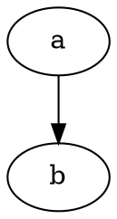
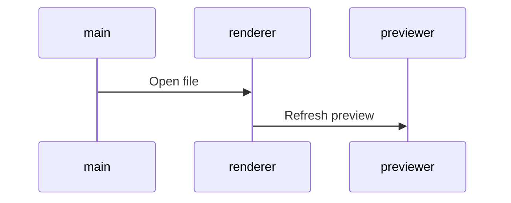

 [SeaPig](https://github.com/yasumichi/seapig) is converter from markdown to html with marked.js and highlight.js.

似たようなネタ、みんな投稿してるし、今更な感じですが、以下の理由から、あえて [SeaPig](https://github.com/yasumichi/seapig) という名前で自作してみました。

- Shiba など素晴らしいソフトが多いのですが、みんなプレビュー止まり。
- 変換結果を***静的*** HTML で保存できる奴が欲しかった。(pandoc 使う手もあるのですが…)
- 環境によらず、PDF で出力できる奴が欲しかった。 
- ***vim キーバインドを使いたい。***

## 筆者の環境

- [VineSeed](https://vinelinux.org/vineseed.html) ([Vine Linux](https://vinelinux.org/) 開発版) 64bit
- [nodebrew](https://github.com/hokaccha/nodebrew) use v4.5.0(LTS)

## 開発方針

- ユーザー自身でインターネットへの参照を記述しない限り、インターネット接続不要とする。
- javascript を使用(CoffeeScript や TypeScript などコンパイルが必要なものを使用しない)
- gulp や bower などのビルドツールは使用しない。
- できるだけ GitHub フレーバーで出力
- 出力する HTML が javascript に依存しないようにする
- ユーザーが好きなキーバインドを使用可能にする(windows/emacs/vim/sublime)

## 各環境向けバイナリファイル

[バージョン 0.9.1](https://github.com/yasumichi/seapig/releases/tag/v0.9.1)に各環境向けのバイナリファイルをアップロードしています。

現在の所、Windows と Linux 向けのみです。(動作、不動作の連絡、お待ちしております。)

## ソースからの起動方法

git および node.js が使える環境で以下を実行してください。

```
$ git clone https://github.com/yasumichi/seapig.git
$ cd seapig
$ git submodule update -i
$ npm install
$ npm build-dep
$ npm start
```

## スクリーンショット


- ツールバー部分は次項で説明します。
- 左側のペインがエディタ、右側のペインが HTML でのプレビューです。

### ツールバーの使い方


ツールバーでのボタンの順番で説明します。

- キーボードアイコンの隣にあるドロップダウンリストでキーバインドを変更します。(default/emacs/vim/sublime)次回起動時には、最後に選択していたキーバインドで起動します。
- 白紙アイコンのボタンでファイルを新規作成します。(新しいウィンドウを開く。)
- フォルダアイコンのボタンでファイルを開きます。
- フロッピーアイコンのボタンでファイルを上書保存します。(新規ファイルのみ名前を付けて保存になる。)
- 変換結果を HTML ファイルとして保存します。この際、使用しているスタイルシート(github.css)を同一フォルダに出力します。
- プリンタアイコンのボタンで変換結果を PDF ファイルとして保存します。
- `<`アイコンでエディタを非表示にします。(エディタが最大化している場合は、通常の大きさに戻します。)
- `>`アイコンでプリビューを非表示にします。(プリビューが最大化している場合、通常の大きさに戻します。)
- 強制的にプリビューを更新します。(Mithril.js のおかげでほぼリアルタイムでプレビューが更新されるのであまり押す機会はないかもしれません。)

### viz.js サポート(v0.3.0にて)

<pre>

</pre>

の様にコードブロックを記述すると viz.js を使用して下の画像のようなグラフを SVG で埋め込めます。(下の画像は出力結果を png に変換したものです。GitHub からうまく svg 画像を表示できないため。)


記述方法の詳細は、@rubytomato@github さんの[Graphvizとdot言語でグラフを描く方法のまとめ - Qiita](http://qiita.com/rubytomato@github/items/51779135bc4b77c8c20d)などを参考にしてください。

### uiflow サポート(v0.5.0にて)

<pre>
```uiflow
[トップページ]
ユーザー名
パスワード
--
ログイン
==>マイページ

[マイページ]
お気に入り

```
</pre>

の様にコードブロックを記述すると uiflow :arrow_right: viz.js を使用して下の画像のような UI フロー図を SVG で埋め込めます。(下の画像は出力結果を png に変換したものです。GitHub からうまく svg 画像を表示できないため。)


記述方法の詳細は、[uiflow](https://github.com/hirokidaichi/uiflow) を参照してください。

### mermaid サポート(v0.7.0にて)

<pre>

</pre>

の様に書くと以下のようなシーケンス図を SVG で埋め込めます。


フローチャート、シーケンス図、ガントチャート、円グラフは、いい感じで使えますが、クラス図、Git グラフの対応はいまいちです。（調査中）

### MathJax サポート(v0.9.0にて)

<pre>
```math
E=mc^2
```
</pre>

のように書くと以下のような数式を SVG で埋め込めます。


## 使用したライブラリ等

- [Ace - The High Performance Code Editor for the Web](https://ace.c9.io/)
- [Electron - Build cross platform desktop apps with JavaScript, HTML, and CSS.](http://electron.atom.io/)
- [electron-json-storage](https://github.com/jviotti/electron-json-storage)
- [electron-localshortcut](https://github.com/parro-it/electron-localshortcut)
- [highlight.js](https://highlightjs.org/)
- [marked](https://github.com/chjj/marked)
- [MathJax](https://www.mathjax.org/)
- [mermaid](https://knsv.github.io/mermaid/)
- [mithril](https://mithril.js.org/)
- [Node.js](https://nodejs.org/en/)
- [Photon](http://photonkit.com/)
- [viz.js](https://github.com/mdaines/viz.js)
- [uiflow](https://github.com/hirokidaichi/uiflow)([forkされたバージョン](https://github.com/tkrkt/uiflow#fix-argument-in-compile)を使用)
- [いらすとや](http://www.irasutoya.com/)(アイコン)

## 競合するアプリケーションを見つけました

[Moeditor](https://github.com/Moeditor/Moeditor)、しかもデザインが今風です :sweat_smile:

## 参考リンク

- [[意訳]私がGulpとGruntを手放した理由 - Qiita](http://qiita.com/chuck0523/items/dafdbd19c12efd40e2de)
- [Electronで設定ファイルを保存する - Qiita](http://qiita.com/KimuraTakaumi/items/fcae3fb9ca62143a00b4)
- [Git submoduleの押さえておきたい理解ポイントのまとめ - Qiita](https://qiita.com/kinpira/items/3309eb2e5a9a422199e9)
- [Electronアプリは、まずelectron-localshortcut入れて、Command+R、Command+Wを潰すのがセオリーだと思う - サイト更新停滞ちうっ](https://taku-o.hatenablog.jp/entry/20181020/1540026153)
