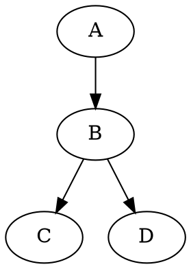
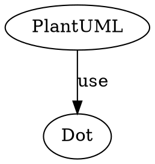

## 概要

[GitBucket](https://gitbucket.github.io/)用のプラグイン [GitBucket Markdown Enhanced Plugin](https://github.com/yasumichi/gitbucket-markdown-enhanced)を開発しています。

GitBucket Markdown Enhanced Plugin は、GitBucket 標準のマークダウンレンダリングエンジンを置き換えるプラグインです。

目標は、[Visual Studio Code](https://code.visualstudio.com/) の [Markdown Preview Enhanced](https://shd101wyy.github.io/markdown-preview-enhanced/#/) 向けの markdown ファイルを軽易に Web で共有できる環境です。

今回は、以下の機能を実装しました。

- [Graphviz](https://graphviz.org/)の描画サポート
- URI を自動でハイパーリンクに変換する機能(メールアドレスは非対応)

## 前回の記事

https://qiita.com/yasumichi/items/78f3e44fb22b93cd52b9

## Graphviz の描画機能の追加

当初、viz.js を使おうかと思いましたが、以下の理由から、同梱の [PlantUML](https://plantuml.com/) を利用することにしました。

- 私の知っている viz.js の正当な upstream が分からない
  - 昔と使い方が大きく変わってしまった?
- あまりクライアント側に負荷を書けたくなかった
- PlantUML が Graphviz の描画に対応している。(元々、Graphviz に依存している。)

既に実装済みの PlantUML の描画部分を共通化して、独自処理が必要な部分を作成しました。

[src\main\scala\io\github\yasumichi\gme\MarkdownEnhancedNodeRenderer.scala](https://github.com/yasumichi/gitbucket-markdown-enhanced/blob/07737ae6eaf4e2378026d7aff8ff7bbef206d45d/src/main/scala/io/github/yasumichi/gme/MarkdownEnhancedNodeRenderer.scala) を修正しました。


```scala
  /**
    * Renders a Graphviz dot diagram from a fenced code block.
    *
    * @param html HtmlWriter to write the output.
    * @param node FencedCodeBlock containing the dot code.
    */
  private def renderDot(html: HtmlWriter, node: FencedCodeBlock, info: String): Unit = {
    var text = "@startdot\n"
    var seqs = node.getContentLines().toArray()
    for (i <- 0 to seqs.length - 1) text = text + seqs(i).toString + "\n"
    text = text + "@enddot\n"

    val patternText = """\{\s*engine=\"(.*)\"\s*\}""".r
    val matches = patternText.findFirstMatchIn(info)
    var engine = ""
    matches match {
      case Some(m) =>
        engine = m.group(1)
      case None =>
        engine = "dot"
    }

    logger.debug("Graphviz engine: " + engine)

    if (!engine.equals("dot")) {
      text = text.replace(
        "{",
        s"""{
       |  graph [layout="${engine}"]; 
       |""".stripMargin
      )
    }

    renderSVG(html, text)
  }
```

[Visual Studio Code](https://code.visualstudio.com/) の [Markdown Preview Enhanced](https://shd101wyy.github.io/markdown-preview-enhanced/#/) プラグインが実装しているエンジンの切替記法も使えるようにしました。

下記コードの `{engine="circo"}` です。

<pre>

</pre>

念のため、SVG への変換部分を掲載します。

```scala
  /**
    * Renders SVG from the given PlantUML or dot text.
    *
    * @param html HtmlWriter to write the output.
    * @param text The PlantUML or dot text to render.
    */
  private def renderSVG(html: HtmlWriter, text: String): Unit = {
    val reader = new SourceStringReader(text)
    val os = new ByteArrayOutputStream()
    reader.generateImage(os, new FileFormatOption(FileFormat.SVG))
    os.close()

    var svg = new String(os.toByteArray(), Charset.forName("UTF-8"))
    var re = "^<\\?xml [^<>]+?\\>".r
    svg = re.replaceFirstIn(svg, "")

    html.tag("div")
    html.append(svg)
    html.tag("/div")
  }
```

## URI を自動でハイパーリンクに変換する機能

当初、[flexmark-java](https://github.com/vsch/flexmark-java) の [AutolinkExtension](https://github.com/vsch/flexmark-java/wiki/Extensions#autolink) という拡張機能を使おうとしましたが、気になる記述を見つけたので自力実装しました。

> current implementation has significant performance impact on large files.

翻訳すると「現在の実装は、大型ファイルに対して大きなパフォーマンスに影響を与える。」とのことです。

まずは、URI 部分を格納する AST Node を作成しました。

[src\main\scala\io\github\yasumichi\gme\InlineUri.scala](https://github.com/yasumichi/gitbucket-markdown-enhanced/blob/07737ae6eaf4e2378026d7aff8ff7bbef206d45d/src/main/scala/io/github/yasumichi/gme/InlineUri.scala)

```scala
package io.github.yasumichi.gme

import com.vladsch.flexmark.util.ast.Node
import com.vladsch.flexmark.util.sequence.BasedSequence

/**
  * InlineUri class
  * 
  * AST node that holds the inline URI syntax of flexmark-java.
  * 
  * `http://example.com` is represented as InlineUri node.
  * 
  * An instance is created by the InlineUriInlineParserExtension class.
  * 
  * The conversion to HTML is handled by the MarkdownEnhancedNodeRenderer class.
  *
  * @param text
  * @param source
  */
class InlineUri(val text: BasedSequence, val source: BasedSequence) extends Node {
  override def getSegments: Array[BasedSequence] = Array(source)
}
```

次にインラインパーサーを作成しました。

[src\main\scala\io\github\yasumichi\gme\InlineUriInlineParserExtension.scala](https://github.com/yasumichi/gitbucket-markdown-enhanced/blob/07737ae6eaf4e2378026d7aff8ff7bbef206d45d/src/main/scala/io/github/yasumichi/gme/InlineUriInlineParserExtension.scala)

```scala
package io.github.yasumichi.gme

import com.vladsch.flexmark.parser.{
  InlineParser,
  InlineParserExtension,
  InlineParserExtensionFactory,
  LightInlineParser
}
import java.util
import java.util.regex.Pattern

/**
  * InlineUriInlineParserExtension class
  *
  * Inline parser extension that parses inline URIs like `http://example.com` and creates InlineUri nodes.
  * 
  * If you write `http://example.com`, it will be converted to an InlineUri node.
  * 
  * The conversion to HTML is handled by the MarkdownEnhancedNodeRenderer class.
  */
class InlineUriInlineParserExtension() extends InlineParserExtension {
  override def finalizeDocument(inlineParser: InlineParser): Unit = {} 
  override def finalizeBlock(inlineParser: InlineParser): Unit = {}
  override def parse(inlineParser: LightInlineParser): Boolean = {
    val input = inlineParser.getInput
    val index = inlineParser.getIndex

    // Define a regex pattern to match inline URIs
    val pattern = """https?:\/\/[\w\/:%#\$&\?\(\)~\.=\+\-]+"""
    val matches = inlineParser.matchWithGroups(Pattern.compile(pattern))
    if (matches != null) {
      inlineParser.flushTextNode()
      val uriText = matches(0)
      inlineParser.getBlock.appendChild(new InlineUri(uriText, uriText))
      return true
    }
    false
  }
}

/**
  * Companion object for InlineUriInlineParserExtension
  * 
  * Factory class to create instances of InlineUriInlineParserExtension.
  * 
  * This factory is used to register the extension with the flexmark parser.
  * 
  * @return InlineUriInlineParserExtension.Factory
  */
object InlineUriInlineParserExtension {
  class Factory() extends InlineParserExtensionFactory {
    override def getCharacters: CharSequence = "h"
    override def apply(inlineParser: LightInlineParser): InlineParserExtension = new InlineUriInlineParserExtension()
    override def getAfterDependents: util.Set[Class[_]] = null
    override def getBeforeDependents: util.Set[Class[_]] = null
    override def affectsGlobalScope(): Boolean = false
  }
}
```

URI かどうかを判定する正規表現は、[正規表現でマッチさせる（URLとメールアドレス編） - きままに記録箱](https://katanugramer.hatenablog.com/entry/2020/07/05/132328)のものを拝借しました。

作成したインラインパーサーを組み込むために既存のクラス MarkdownEnhancedExtention の  extend メソッドを周囲しました。

[src\main\scala\io\github\yasumichi\gme\MarkdownEnhancedExtention.scala](https://github.com/yasumichi/gitbucket-markdown-enhanced/blob/07737ae6eaf4e2378026d7aff8ff7bbef206d45d/src/main/scala/io/github/yasumichi/gme/MarkdownEnhancedExtention.scala)

```scala
  /**
  * Extend the parser with custom inline parser extension
  *
  * @param parserBuilder The parser builder to extend
  */
  override def extend(parserBuilder: Parser.Builder): Unit = {
    parserBuilder.customInlineParserExtensionFactory(new MarkInlineParserExtension.Factory())
    parserBuilder.customInlineParserExtensionFactory(new InlineUriInlineParserExtension.Factory())
  }
```

実際にハイパーリンクに変換する部分は、既存のクラス MarkdownEnhancedNodeRenderer に追加しました。

[src\main\scala\io\github\yasumichi\gme\MarkdownEnhancedNodeRenderer.scala](https://github.com/yasumichi/gitbucket-markdown-enhanced/blob/07737ae6eaf4e2378026d7aff8ff7bbef206d45d/src/main/scala/io/github/yasumichi/gme/MarkdownEnhancedNodeRenderer.scala)

```scala
/**
    * Renders an inline URI as a clickable link.
    *
    * If you write `http://example.com`, it will be converted to `<a href="http://example.com">http://example.com</a>`.
    * 
    * @param node InlineUri node representing the inline URI.
    * @param context NodeRendererContext for rendering context.
    * @param html HtmlWriter to write the output.
    */
  private def renderInlineUri(
      node: InlineUri,
      context: NodeRendererContext,
      html: HtmlWriter
  ): Unit = {
    val uri = node.text.toString()
    html
      .withAttr()
      .attr("href", uri)
      .tag("a")
    html.text(uri)
    html.tag("/a")
  }
```

renderInlineUri メソッドが呼ばれるように getNodeRenderingHandlers メソッドに以下の記述を追加しました。

```scala
    set.add(
      new NodeRenderingHandler[InlineUri](
        classOf[InlineUri],
        this.renderInlineUri
      )
    )
```

### 2025/12/09 追記

`InlineUriInlineParserExtension` の `parse` メソッドにバグがあり、`[アンカー] (URI)` で生成されるリンクを崩してしまう場合がありました。

[現在のコード](https://github.com/yasumichi/gitbucket-markdown-enhanced/blob/main/src/main/scala/io/github/yasumichi/gme/InlineUriInlineParserExtension.scala#L24) では、以下のように修正しています。

```scala
  override def parse(inlineParser: LightInlineParser): Boolean = {
    val input = inlineParser.getInput
    val index = inlineParser.getIndex

    // Define a regex pattern to match inline URIs
    val pattern = """(^|[^\(]+)(https?:\/\/[\w\/:%#\$&\?\(\)~\.=\+\-]+)"""
    val matches = inlineParser.matchWithGroups(Pattern.compile(pattern))
    if (matches != null) {
      inlineParser.flushTextNode()
      val uriText = matches(2)
      inlineParser.getBlock.appendChild(new InlineUri(uriText, uriText))
      return true
    }
    false
  }
```

直前が `(` 以外の文字か行頭である場合に変換するように修正しました。

## スクリーンショット

<pre>
# test

http://localhost:8080/gitbucket/yasumichi/test/

example@example.com


</pre>

上記マークダウンが、スクリーンショットのように変換できました。


