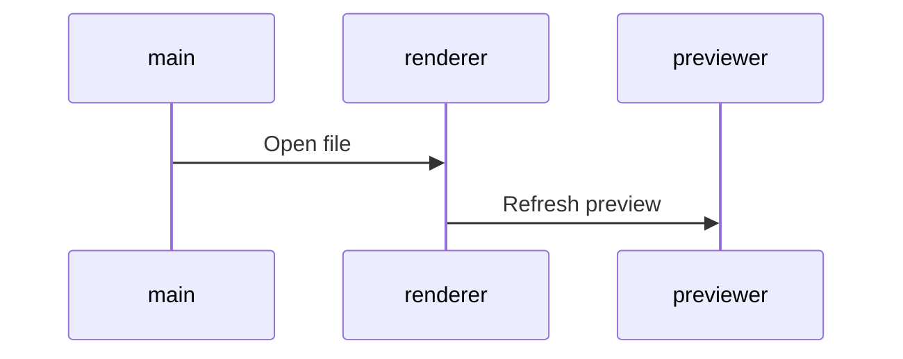

# 経年変化について

この記事は、2019年10月05日に書いた記事であり、2025年12月6日現在では、事情が変わっています。

mermaid.render() は、非同期関数となり、コールバック関数を受け取らなくなりました。

現在では、呼び出す側の関数に `async` をつけておき、以下のように呼び出すようになっています。

```js
await mermaid.render(id, txt, container);
```

Promise が返るので `async`,`await` をつけずに `Promise.then()` を使うことも可能だと思います。

しかしながら、現在のベストプラクティスは、`<div class=""></div>` で mermaid 記法を囲んでおいて、`mermaid.run()` を呼び出すことが推奨されているようです。

```js
await mermaid.run();
```

以下も参考になれば。

https://qiita.com/yasumichi/items/903eaf20276b2c01b8fa

# はじめに

私は、[SeaPig](https://github.com/yasumichi/seapig) という Markdown を HTML に変換するアプリケーションを開発しています。その中でフローチャートやシーケンス図、ガントチャートなどを Markdown 風な記法で表現し、SVG に変換できる [mermaid](https://mermaidjs.github.io/) という JavaScript のライブラリを利用しています。



上記のように書くと以下のような画像を生成してくれます。


# この記事を書くきっかけ

ある時、HTML プレビューが更新される度に body の最初に空の &lt;div&gt; 要素が増えていくバグに気がつきました。原因がしばらく分からなかったのですが、[D3.js - Data-Driven Documents](https://d3js.org/) を学習する機会もあり、mermaid のソースを読むことで原因が分かったのでこの記事を書くことにしました。

結論的には、[ドキュメント](https://mermaidjs.github.io/#/mermaidAPI?id=render)を正確に嫁、って言われてしまいそうですけど :sweat_smile: 

# mermaidAPI.render() の動作について

まず、`mermaidAPI.render()` のプロトタイプは、以下の通りです。

```javascript
mermaidAPI.render(id, txt, cb, container)
```

|引数|指定内容|
|:--|:--|
|id|描画したい SVG 画像の id を文字列で指定します。|
|txt|元になる memaid 記法の文字列を指定します。|
|cb|SVG 画像の描画が完了した時に呼び出されるコールバック関数を指定します。|
|container|作業用に使用する DOM 要素を指定します。|

第３引数 cb と 第４引数の container を省略しても見かけ上、動作するのですが、先ほど書いたようにごみ要素が増殖してしまいます。

よく読めば、`container` の説明に以下のように書いてあるので当然といえば、当然なのですが… :sweat_smile: 

> In one is provided a hidden div will be inserted in the body of the page instead. The element will be removed when rendering is completed.

## 内部的に何をやっているか

ソースを見てみます。

## `container` が指定された場合

以下、[mermaid/src/mermaidAPI.js の 420行目](https://github.com/knsv/mermaid/blob/master/src/mermaidAPI.js#L420) から抜粋

```javascript:mermaid/src/mermaidAPI.js(抜粋)
const render = function(id, txt, cb, container) {
  if (typeof container !== 'undefined') {
    container.innerHTML = '';

    d3.select(container)
      .append('div')
      .attr('id', 'd' + id)
      .append('svg')
      .attr('id', id)
      .attr('width', '100%')
      .attr('xmlns', 'http://www.w3.org/2000/svg')
      .append('g');
  } else {
```

関数の冒頭は、引数 container が未定義(`undefined`)でない場合つまり指定された場合の処理となります。

この場合、最初に `container.innerHTML = '';` を行っています。[ドキュメント](https://mermaidjs.github.io/#/mermaidAPI?id=render)の container の説明には、

> selector to element in which a div with the graph temporarily will be inserted.

と書いてあるので `div#mermaidContainer` のようなセレクターを指定するのかと思いましたが、セレクターを指定してしまうと `container.innerHTML = '';` の処理で例外が発生してしまいます。なので `document.getElementById()` などで取得した Element オブジェクト指定する必要があります。

コンテナ要素を空にした後は、概ね、以下のことをやっています。

- `container` の子として、div 要素を追加
- その div 要素に `id` の先頭に　'd' という文字列を付加した id を設定
- 上記の div 要素の子として svg 要素を追加し、id や width などの属性を設定
- svg 要素に最初の g 要素（グループ化要素）を追加

## `container が未定義の場合

```javascript:mermaid/src/mermaidAPI.js(抜粋)
const render = function(id, txt, cb, container) {
  if (typeof container !== 'undefined') {
// （中略）
  } else {
    const element = document.querySelector('#' + 'd' + id);
    if (element) {
      element.innerHTML = '';
    }

    d3.select('body')
      .append('div')
      .attr('id', 'd' + id)
      .append('svg')
      .attr('id', id)
      .attr('width', '100%')
      .attr('xmlns', 'http://www.w3.org/2000/svg')
      .append('g');
  }
```

- 指定された `id` の先頭に 'd' という文字列を付与した要素がないかを検索し、内容を空にします。
- body 要素の子として div 要素を追加し、`id` の先頭に 'd' という文字列を付与した id を設定（既存のものがあれば再利用）
- 上記の div 要素の子として svg 要素を追加し、id や width などの属性を設定
- svg 要素に最初の g 要素（グループ化要素）を追加

## というわけで

mermaidAPI.render() を使用する場合は、フロントエンドとなる HTML 内に作業用の要素をあらかじめ用意しておいて、第４引数に与えてやった方が良いです。

:exclamation: d3 を使っている関係上、DocumentFragment 内の要素を与えることは出来ません。

この際、コールバック関数を使わない場合は、第３引数に `undefined` を与えれば良いです。`null` だと例外が発生するので注意しましょう。

ちなみにコールバック関数を使用する部分のソースが、[mermaid/src/mermaidAPI.js の 561行目](https://github.com/knsv/mermaid/blob/master/src/mermaidAPI.js#L561) にあります。

```javascript:mermaid/src/mermaidAPI.js(抜粋)
  if (typeof cb !== 'undefined') {
    switch (graphType) {
      case 'flowchart':
        cb(svgCode, flowDb.bindFunctions);
        break;
      case 'gantt':
        cb(svgCode, ganttDb.bindFunctions);
        break;
      default:
        cb(svgCode);
    }
  } else {
    logger.debug('CB = undefined!');
  }
```

最後に使用例を。

```html:sample.html
<!DOCTYPE HTML>
<html lang="ja">
<head>
  <meta charset="UTF-8">
  <title>mermaidAPI.render() 実行例</title>
  <script src="mermaid.min.js"></script>
  <style>
  textarea#svgCode {
    width: 90%;
    height: 50vh
  }
  </style>
</head>
<body>
  <div id="mermaidContainer"></div>
  <textarea id="svgCode"></textarea>
  <div id="svgContainer"></div>
  <script>
const mermaidAPI = mermaid.mermaidAPI;
const diagram = `sequenceDiagram
    participant main
    participant renderer
    participant previewer
    main->>renderer: Open file
    renderer->>previewer: Refresh preview`;
const svgId = "mermaidExample";
const container = document.getElementById("mermaidContainer");
const svgCode = document.getElementById("svgCode");
const svgContainer = document.getElementById("svgContainer");

// mermaidAPI をまず初期化します
mermaidAPI.initialize({
  startOnLoad: false,
  theme: null
});

// mermaid 記法から SVG を作成し、シリアライズされた文字列を取得します。
var svg = mermaidAPI.render(svgId, diagram, undefined, container);

svgCode.innerText = svg;
svgContainer.insertAdjacentHTML('afterbegin', svg);
  </script>
</body>
</html>
```

Internet Explorer では動作しないのであしからず…。

# 2019/10/13追記 display:none の要素を container にした場合に必要な設定について

ガントチャートや円グラフなどで幅が取得できず、描画が崩れるため、mermaidAPI 初期化時に以下の設定を行う必要があります。

```javascript
  mermaidAPI.initialize({
    // ここにその他、必要な設定を書く。
    gantt: {
      useWidth: 800
    },
    class: {
      useWidth: 800
    }
  });
```

# 2019/10/14追加 結論として display:none な要素を container に指定すると描画が崩れます

隠したければ、position:absolute や z-index を低くして裏に隠してしまうというのが、良いようです。

# 参考リンク

- [mermaid - Markdownish syntax for generating flowcharts, sequence diagrams, class diagrams, gantt charts and git graphs.](https://mermaidjs.github.io/#/)
- [D3.jsの概要と使い所について - Qiita](https://qiita.com/cawpea/items/8d66e1a1df9e2d64fef6)
- [SVGとD3.jsの入門まとめ - Qiita](https://qiita.com/simonritchie/items/16bfa1f9f80db10cb5ae)
- [element.insertAdjacentHTML - Web API | MDN](https://developer.mozilla.org/ja/docs/Web/API/Element/insertAdjacentHTML)
- [DocumentFragment - Web API | MDN](https://developer.mozilla.org/ja/docs/Web/API/DocumentFragment)
